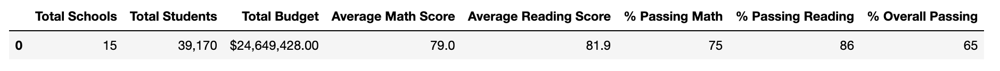
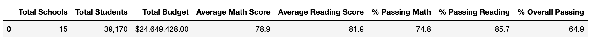
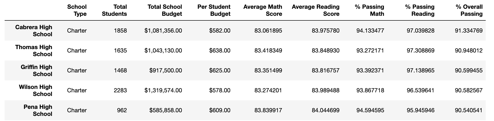
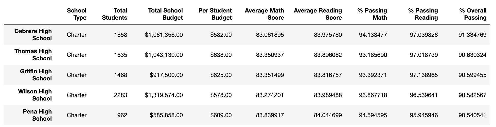
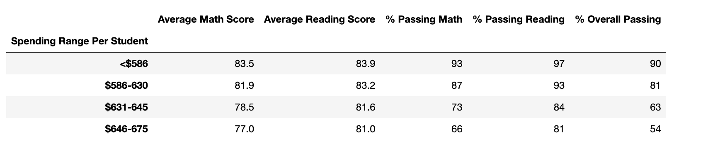
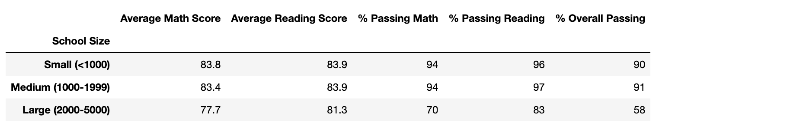
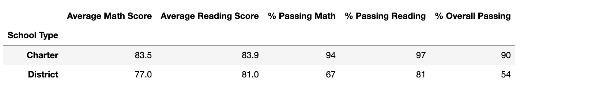

# school_district_analysis


## 1. Overview of School District Analysis

Here, I used Pandas in Jupyter Notebooks high school math and reading scores from a local school district. 
Specifically, I re-analyzed district-wide data after dropping 9th grade scores from one school (Thomas High School) 
since it appears those scores, which were included in an earlier analysis, were altered through academic dishonesty.
With this cleaned dataset, I summarized spending rates, average test scores, and passing rates for all schools in the district;
and calculated average math and reading scores by grade, by per-capita school budget, and by school size.


## 2. Results

Raw analyses and results are available in the notebook ```PyCitySchools_Challenge.ipynb```

### District Analysis

- At the district-level, removing altered grades has a minimal effect on average grades, and passing rates.
Here are grades using the complete dataset:

Grades and passing rates from the cleaned dataset are only marginally lower than in the original analysis:


### School Performance

- Removing math and reading scores for Thomas High 9th graders does not impact the school's overall testing performance 
relative to other schools. Thomas High School (THS) was the 2nd-highest ranked school in the district in both analyses,
with an original overall passing rate of 90.95%:

Its passing rate actually improved after reanalysis to 90.63%:



### Test Scores by School Spending

- Removing altered scores did not change results based on per-capita school spending. As a general result, schools that spend
less money per student have higher math and reading scores, and overall passing rates on standardized tests:
 

### Test Scores by School Size

- Similary, removing test scores did not change results based on school size. Generally, smaller schools demonstrate higher
test scores and passing rates:
 

### Test Scores by School Type

- Finally, charter schools tend to perform better than district schools:
 


## 3. Summary

Overall, removing test scores for THS 9th graders (and replacing them with NaNs) has a minimal quantitative effect, 
and no qualitative effect, on overall results for the school district. 